In this simulation, we are exploring the Solidity compiler to perform simple tasks and learn about 
**if and looping structures**, and **classes and objects**.

**Step 1**: On the top-right side, click the **New File** button to start creating a Solidity file.  

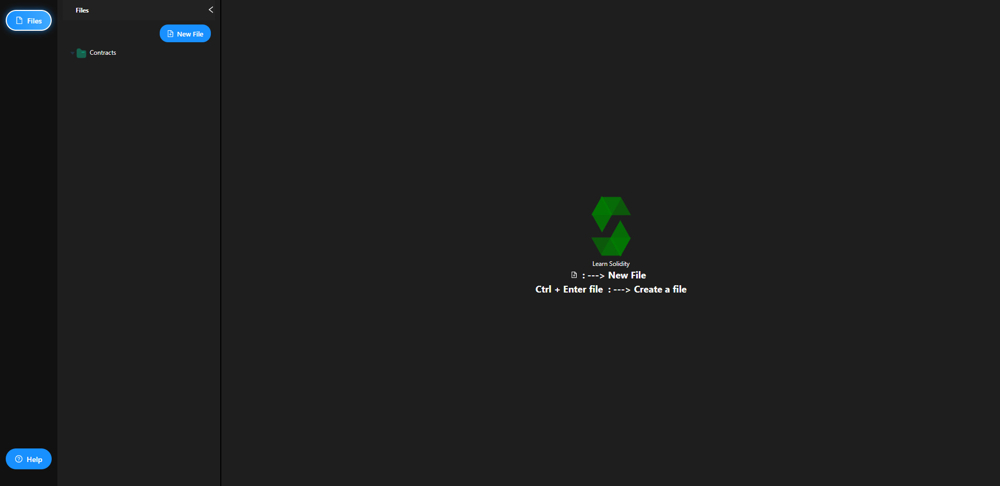

**Step 2**: Enter the filename with the extension **.sol** (example: `test.sol`) and press **Enter**.  

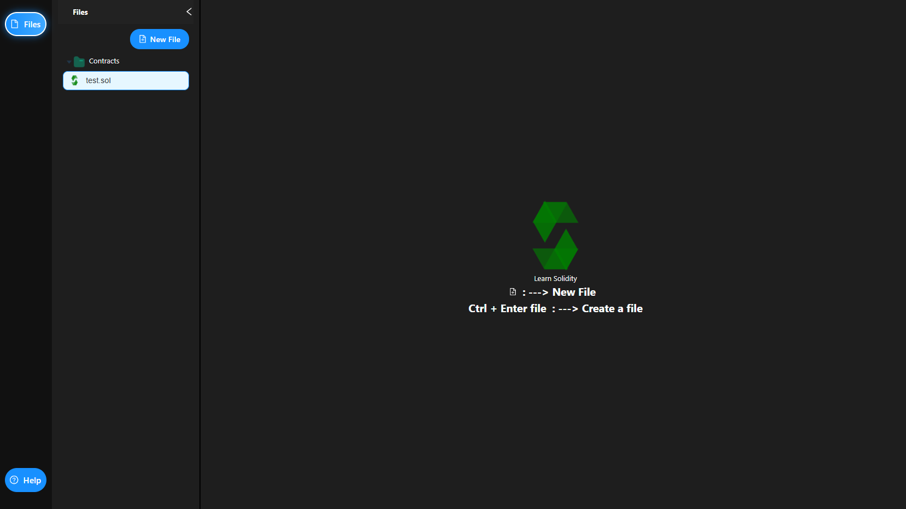

**Step 3**: After creating the file, a window will appear asking you to select a tutorial. Choose one option from **If Else**, **Loop**, or **Classes**.  

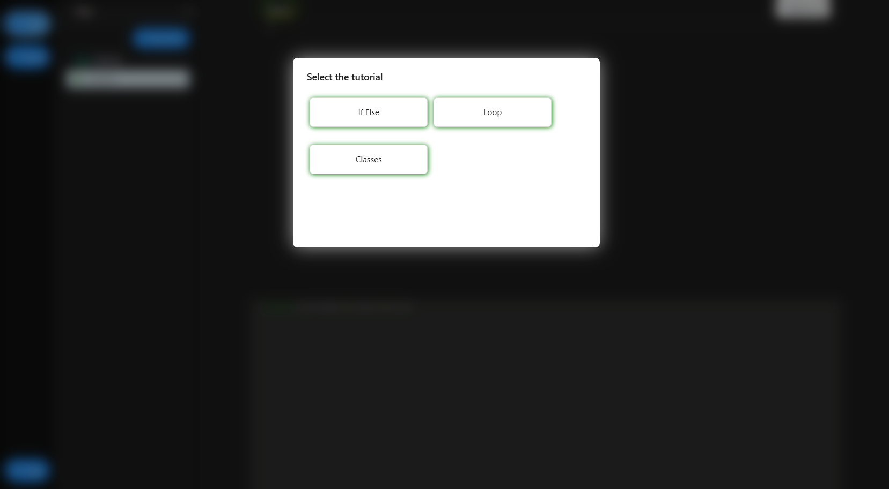

**Step 4**: If you select **If Else**, you will be redirected directly to the **If Else Exercise**. Carefully read all the given instructions, complete the exercise, and then click the **Run & Compile** button.  

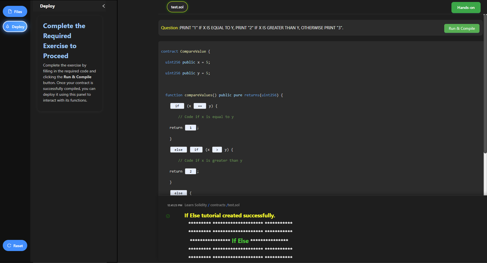

**Step 5**: Once your contract is **successfully compiled**, the **Deployment Panel** will be activated. From there, select your contract (e.g., `test.sol`) in the dropdown and click **Deploy Contract**. After deployment, you will see the **If-Else Deployed Contract**.  

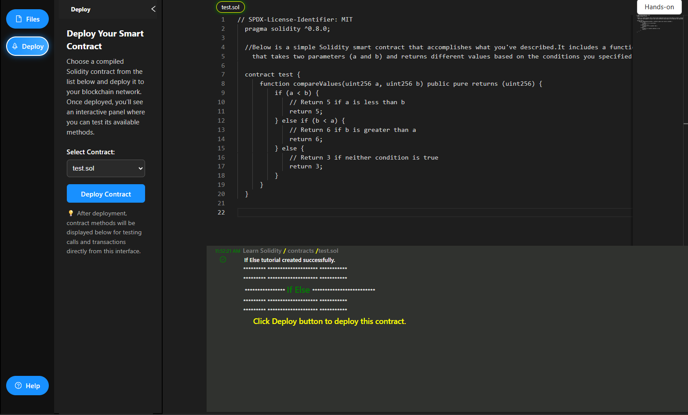

**Step 6**: After deployment, the **If-Else Exercise** will be shown inside the **Deployed Contract** panel. Enter two numbers (a and b), then click **compareValues** to test the contract logic.  

If you want to try another tutorial, click the **Files** tab, create a new file, select a different tutorial, and then deploy it.  

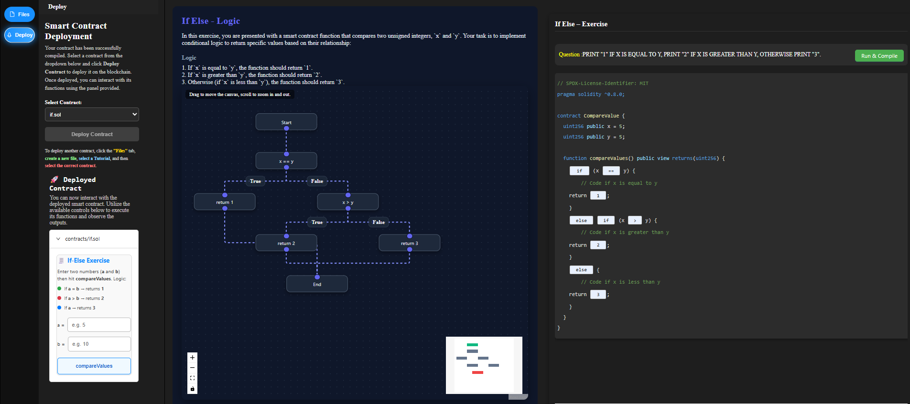

**Step 7**: After clicking the **Run & Compile** button, enter any values for **a** and **b** in the input fields.  
Then click the **compareValues** button to view the correct result returned by the contract.  

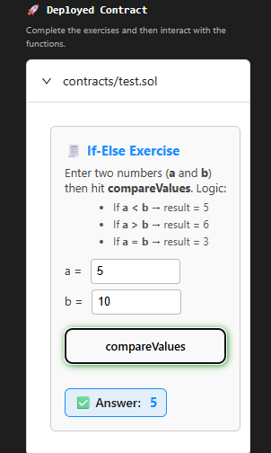

<u><h4>Hands-On Exercise</h4></u>

1. After completing the exercise, go to the <b>Hands-On</b> section.  
Click the <b>Hands-On</b> button available at the top to start the practical task.  

2. Before starting the Hands-On experiment, first go through the section <b>Learn Some Important Topics</b>.

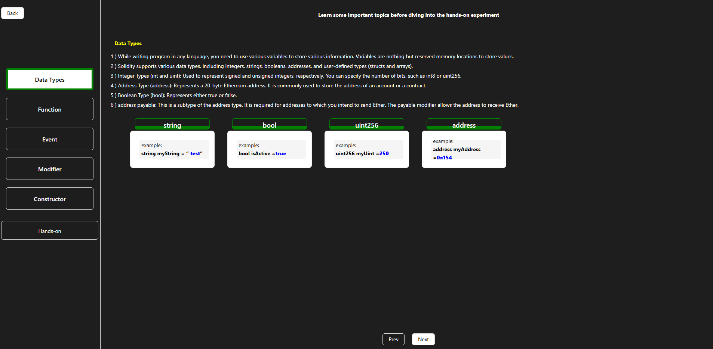
  
Click the <b>Next</b> button to explore key concepts such as <b>Datatypes</b>, <b>Functions</b>, <b>Events</b>, <b>Modifiers</b>, and <b>Constructors</b>.  
After completing this section, click the <b>Hands-On</b> button to begin the experiment.  

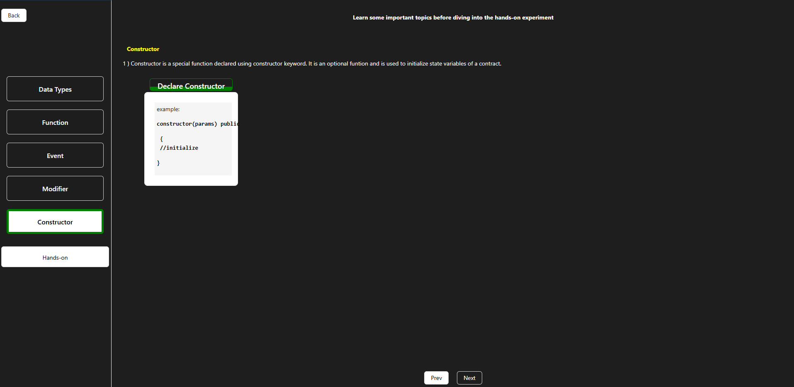

3. In the Hands-On section, complete all the given tasks by selecting the correct stack and finishing the exercise.  

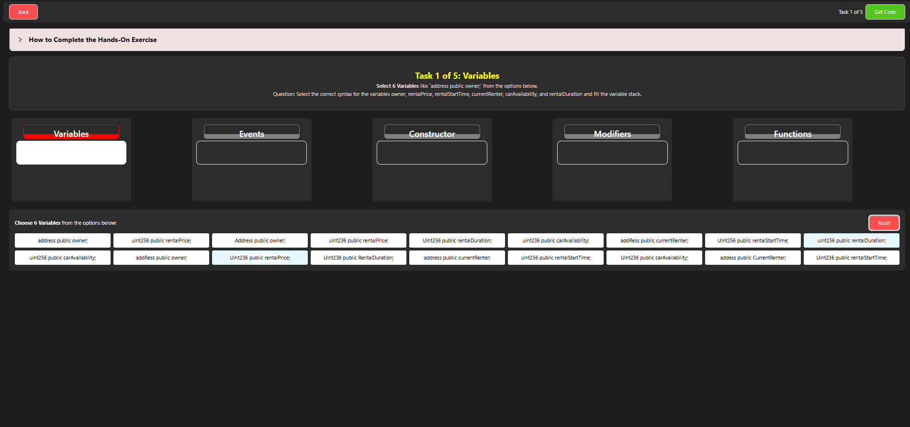

After successfully completing the Hands-On activity, click the <b>Get Code</b> button to view and download the solution code.  

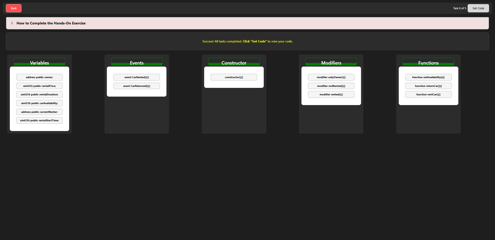

4. After clicking the <b>Get Code</b> button, view the complete final code of your Solidity program.  
This code represents the full solution for the Hands-On experiment.  

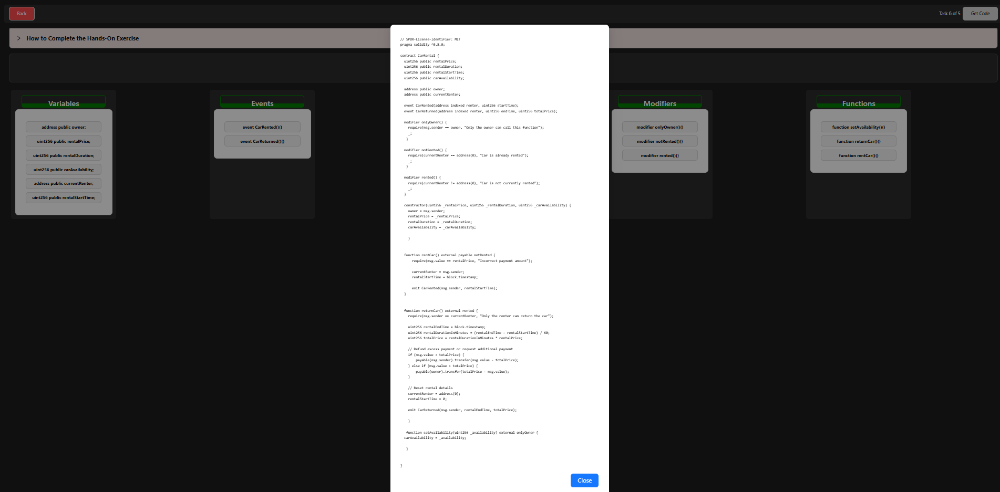

<h5>End of Procedure</h5>

You have successfully completed the Solidity simulation experiment.  
From creating a new file, learning important concepts, deploying contracts, to completing the Hands-On section and viewing the final code — the procedure is now complete.

