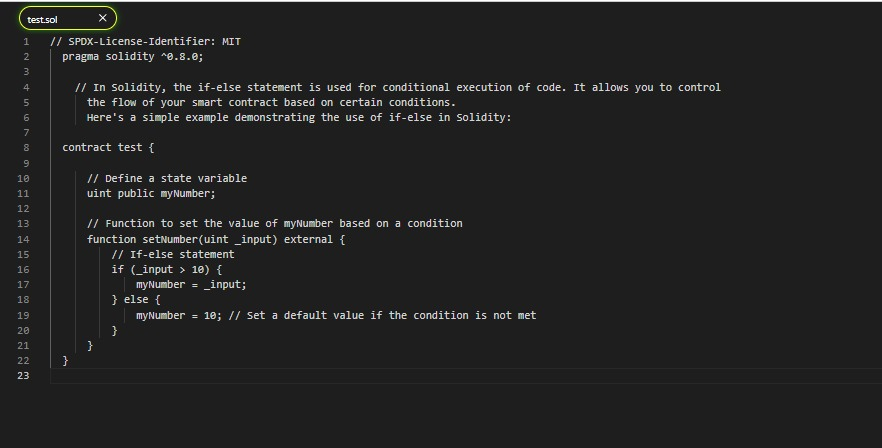

<u><h3>Procedure</h3></u>

In this simulation we are exploring solidity complier to perform simple tasks using solidity to learn and  Explore "if and looping structures",  "classes and objects".

 step 1 : read the instructions on the interface shown carefully and  start the simulation by creating file .

step 2 :  To create a Solidity file, click on the icon indicated, and when prompted, enter the desired filename with the extension ".sol". press "Control + Enter."

  step 3 : successfully created the file .

 step 4 : You can now observe three options indicating tutorials on looping, classes, and if-else structures. select one of the tutorials to learn the syntax 

step 5 : observe the syntax of if -else  and read the instruction carefully .

step 6 :  observe and understand the given syntax for classes and objects .

step 7 : read the instructions carefully to understand the given syntax for looping structures.

