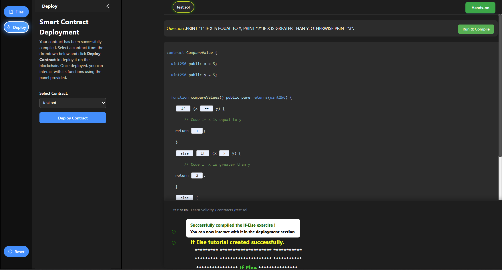

<h3>Procedure</h3>

In this simulation we are exploring the Solidity compiler to perform simple tasks and learn about 
"if and looping structures", and "classes and objects".

Step 1 : On the top right side, click the <b>New File</b> button to start creating a Solidity file.  

Step 2 : Enter the filename with the extension <b>.sol</b> (example: test.sol) and press <b>Enter</b>.  

Step 3 : After creating the file, a window will appear asking you to select a tutorial. Choose one option from <b>If Else</b>, <b>Loop</b>, or <b>Classes</b>.  

Step 4 : If you select <b>If Else</b>, observe the Solidity code and read the given instructions carefully.  
Then, click the <b>Deploy</b> button on the left side.  

Step 5 : In the deploy panel, select your contract (e.g., <b>test.sol</b>) from the dropdown and click <b>Deploy Contract</b>.  

Step 6 : Read the instructions carefully. Enter values for <b>a</b> and <b>b</b> as inputs, then click <b>compareValues</b> to check the output of the function.  
After this, a dialog box will appear — click <b>Go To Exercise</b> to proceed.  

Step 7: To complete the exercise, fill in the blank in the if statement with the correct condition.  
After entering the correct code, click the <b>Run & Compile</b> button on the top right to continue.  

Step 8: After clicking the <b>Run & Compile</b> button, enter any values for <b>a</b> and <b>b</b> in the input fields.  
Then click the <b>compareValues</b> button to view the correct answer returned by the contract.  

<u><h4>Hands-On Exercise</h4></u>

1. After completing the exercise, go to the <b>Hands-On</b> section.  
Click the <b>Hands-On</b> button available at the top to start the practical task.  

2. Before starting the Hands-On experiment, first go through the section <b>Learn Some Important Topics</b>.

  
Click the <b>Next</b> button to explore key concepts such as <b>Datatypes</b>, <b>Functions</b>, <b>Events</b>, <b>Modifiers</b>, and <b>Constructors</b>.  
After completing this section, click the <b>Hands-On</b> button to begin the experiment.  

3. In the Hands-On section, complete all the given tasks by selecting the correct stack and finishing the exercise.  

After successfully completing the Hands-On activity, click the <b>Get Code</b> button to view and download the solution code.  

4. After clicking the <b>Get Code</b> button, view the complete final code of your Solidity program.  
This code represents the full solution for the Hands-On experiment.  

<h5>End of Procedure</h5>

You have successfully completed the Solidity simulation experiment.  
From creating a new file, learning important concepts, deploying contracts, to completing the Hands-On section and viewing the final code — the procedure is now complete.

