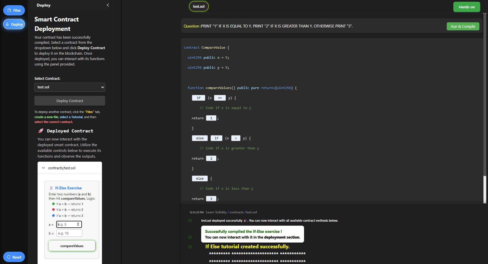

This simulation introduces the Solidity compiler through guided tasks designed to teach fundamental programming concepts, including conditional statements (if-else), looping structures, and data organization using structs (which provide object-like behavior in Solidity). Participants will also complete a practical Hands-On Exercise based on a Car Rental Smart Contract.

##### Step 1: Select a Tutorial

From the left sidebar, click the **Files** button and select one of the predefined Solidity tutorial files from the Contracts list, such as:

- `if.sol`
- `loop.sol`
- `classes.sol`

Selecting a tutorial file automatically loads the **Smart Contract Syntax and Coding Process** page, where you can review the instructions and logic for the selected tutorial.

##### Step 2: Review Logic and Flowchart

After selecting the tutorial file, the corresponding Logic page (e.g., **If Else – Logic**) is displayed.

Carefully read the problem description and logic rules shown at the top.

Observe the interactive flowchart that visually represents the conditional execution flow:

- You can drag the canvas to move the flowchart.
- Scroll to zoom in or out for better visibility.

Once you fully understand the logic and execution flow, click the **Proceed to Exercise** button to move to the coding section.

##### Step 3: Complete the Exercise and Compile

In the Exercise panel (e.g., **If Else – Exercise**):

1. Carefully read the question.
2. Fill in the missing `if`, `else if`, and `else` conditions.
3. Click the **Run & Compile** button.

If the code is correct, the compilation will succeed.

##### Step 4: Deploy the Smart Contract

Once compilation is successful:

- The Deployment Panel becomes active on the left.
- Select the contract (e.g., `if.sol`) from the dropdown.
- Click **Deploy Contract**.

You will see a confirmation message and a **Deployed Contract** section.

##### Step 5: Interact with the Deployed Contract

After deployment:

- The exercise interface appears inside the **Deployed Contract** panel.
- Enter values for `a` and `b`.
- Click the **compareValues** button.

The contract executes on the deployed instance and returns the result.

##### Step 6: View the Result

The result is displayed clearly below the button.

This confirms that the if–else logic works correctly.

#### Continuing with the Remaining Tutorials

After successfully completing the If Else exercise, repeat the same procedure for the remaining tutorials:

- Select `loop.sol` to practice looping constructs such as `for` and `while`.

- Select `classes.sol` to understand Solidity structures, classes, and object-like behavior.

#### Use-case Exercise (Car Rental Contract)

**Step 1**: From the main screen, click the **Use-case** button to start the practical task.

**Step 2**: The simulation will start with the **Car Rental Contract: Creation & Deployment** worksheet. The first step is to **Reset scenario**. Click the **Reset scenario** button to start from a clean chain.

**Step 3**: The next step is to **Deploy contract as Owner**. Click the **Deploy contract** button to deploy the rental contract with yourself as owner. Record the deployed address.

**Step 4**: The next step is to make a **Successful tx: User rent(3) with payment**. Click the **Send rent(3)** button to call rent(3) with the required payment. Capture gas used and cost from the receipt.

**Step 5**: The next step is to make a **Revert tx: rent again**. Click the **Send rent() (expect revert)** button to attempt to rent again without returning first. Observe the revert reason and note why gas was still consumed.

**Step 6**: The final step is to **Return car as Owner**. Click the **Return car** button to switch to owner and call returnCar(). State should show the car is available again.

